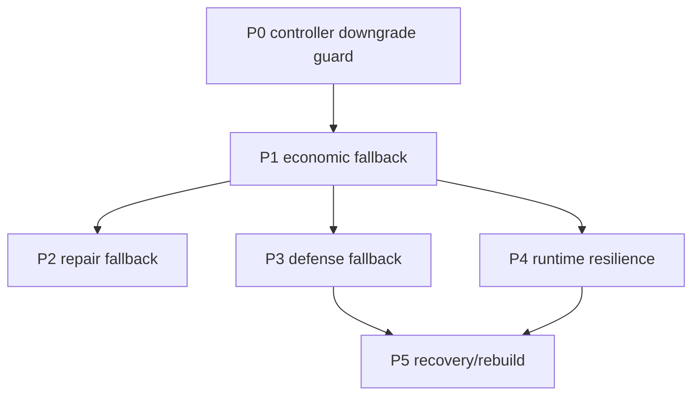

# Survival fallback roadmap P0-P5 design

## Architecture Boundary

The parent task owns coordination only. Child tasks own implementation plans:

- P0 owns controller downgrade guard.
- P1 owns economic fallback and construction backpressure.
- P2 owns maintenance/repair fallback.
- P3 owns defense/safe mode fallback.
- P4 owns runtime resilience and monitoring fallback.
- P5 owns fallen-room recovery and rebuild fallback.

P0 is the first implementation slice. P1-P5 must not re-implement P0 implicitly; they consume its safety signal after it is live.

## Dependency Order

## Parallelization Rules

Research can run in parallel across P0-P5.

Code implementation should be sequential unless scopes are split again because these tasks all touch one or more of:

- `src/runtime/screeps-runtime.ts`
- `src/kernel/run-tick.ts`
- `src/creeps/worker-decision.ts`
- `test/integration/main-loop.test.ts`

Safe parallel splits inside a future implementation phase:

- Pure P3 `src/defense/` decision tests can proceed while P2 pure repair target tests run.
- P4 docs/spec/monitor research can proceed while P0/P1 pure worker priority tests run.
- Runtime/kernel integration must be a single-owner slice at a time.

## Mature Pattern Adaptation

- Overmind style: use urgent spawn/upgrade and CPU degraded states, but do not import global object graph or overlord framework.
- KasamiBot style: keep low-RCL universal worker behavior; add dedicated concepts only when RCL and structures justify them.
- TooAngel style: detect fallen/trapped room conditions, but keep recovery outputs diagnostic until multi-room execution exists.
- Official API: actions remain Screeps action calls executed by runtime boundary.

## Completion Contract

Planning is complete when each child has:

- Testable PRD acceptance.
- Concrete contracts in design.
- Ordered implement checklist.
- Explicit validation commands.
- Clear out-of-scope list.
- P0 dependency stated where applicable for P1-P5.
