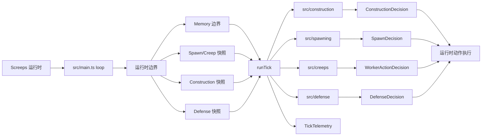

# 架构

## 运行时流程

`src/main.ts` 刻意保持很薄，只负责捕获 Screeps 运行时边界并调用 kernel。

`src/runtime/` 拥有对 Screeps 全局对象的直接访问权。策略模块应从该边界接收明确输入，而不是自行读取全局对象。该边界也负责捕获 `Game.cpu` snapshot、执行 critical `Game.notify` fallback 和输出结构化 tick heartbeat。

`src/kernel/` 拥有 tick 级编排。当前实现记录 tick telemetry，把 runtime 快照交给 defense、construction、spawning 和 creeps 边界产出可测试的决策，并通过 runtime boundary 执行 safe mode、construction、spawn 和 worker action。kernel 根据 CPU bucket 选择 full 或 survival-only tick budget；低 bucket 时保留 defense、emergency spawn 和 controller upgrade，跳过非关键 construction/repair。runtime operation 按 defense、spawn、critical worker、construction、non-critical worker 分组隔离，关键组失败会先通知再抛出，非关键组失败会通知并继续当前 tick。

`src/memory/` 负责原始 `Memory` 的校验、schema version、迁移入口和写回。当前 schema 只有项目 root 与 `schemaVersion`，在 creep、room、spawn 状态进入前先建立单一持久化边界。

`src/spawning/` 拥有 spawn 决策。当前 bootstrap worker decision 在 300 energy 可用时优先选择 `[WORK, CARRY, CARRY, MOVE, MOVE]`，在只有 200 energy 可用时保留 `[WORK, CARRY, MOVE]` emergency worker，并由 runtime boundary 执行 `spawnCreep`。

`src/construction/` 拥有纯 construction planner。当前 planner 为 RCL2 owned room 规划缺失的 5 个 extension construction site，跳过 spawn、source、controller、已有结构、已有 construction site、edge 和 wall tile，并由 runtime boundary 执行 `Room.createConstructionSite`。

`src/creeps/` 拥有 bootstrap worker action 决策。当前 worker 按 creep name 和 source id 在同房间 source 之间做确定性分配；满能量后优先补能 spawn/extension；controller downgrade safe 时 build construction site 优先于 upgrade controller；controller downgrade recovering/warning 时同房间按 creep name 排序的第一个满能 worker upgrade 后其他满能 worker 可 build；critical 时所有满能 worker upgrade。P2 critical repair fallback 只维护已有 spawn、extension、container 和 road，优先级低于 spawn/extension refill 与 P0 controller downgrade guard，高于 ordinary build。runtime boundary 捕获 owned controller `level` 和 `ticksToDowngrade`、owned room 结构 hits 快照，执行 harvest、transfer、repair、build 和 upgradeController，并在 out of range 时执行 moveTo。

`src/defense/` 拥有纯 defense fallback 决策。当前 planner 使用 runtime 捕获的 Screeps body part constants 和 official combat power constants 识别 hostile `canDamage`、`canDismantle`、`canHeal` 和 `nearCore`；当危险 hostile 接近 spawn/extension/tower 且 controller safe mode 可用时产出 `activateSafeMode` decision。`RoomDefenseState` 会传入 colony construction eligibility，让有攻击/拆除威胁的房间暂停非关键 build。Tower attack/heal/repair policy 仍是 RCL3 后续切片。

`src/colony/` 拥有 room-level recovery 诊断。当前 `planRoomRecovery` 是纯分类操作，基于 owned controller、owned spawn、worker 数、controller downgrade state 和 room defense state 输出 `roomHealthy`、`roomDegraded`、`spawnMissing`、`creepPopulationMissing`、`controllerLost` 和 `rebuildBlocked`。当前实现不生成跨房 rebuild action，不做 pathfinding，也不做 claim。

其他未来领域模块应围绕 Screeps 概念划分，例如 colony、creeps、logistics、pathing、defense、market。领域模块产出决策或 action request；最终 Screeps action 由运行时拥有的操作统一裁决和执行。

CPU 和 bucket 行为是架构的一部分。当前 heartbeat 以 `[HERMES_EVENT]` 的 `runtime_heartbeat` JSON 事件输出 `cpu`、`bucket`、`limit`、`tickLimit`、budget decision 和每房间 `workers`、`spawnEnergy`、`construction`、`hostiles` 摘要。Pathfinding、room scan、market scan、cache rebuild 在实现前必须明确预算、执行频率和低 bucket 行为。

## 测试层

| 层级                | 入口                                                                                | 用途                                                          |
| ------------------- | ----------------------------------------------------------------------------------- | ------------------------------------------------------------- |
| Unit                | `test/unit/`                                                                        | 通过公开 TypeScript 接口验证纯行为                            |
| Integration         | `test/integration/`                                                                 | 在边界 stub Screeps 全局对象，验证源码级模块协作              |
| System              | `test/system/`                                                                      | 验证脚本、包管理器等项目级契约                                |
| Bundle smoke        | `pnpm test:bundle` / `test/e2e/`                                                    | 构建并加载 `dist/main.js`，不启动真实 Screeps engine          |
| Local server e2e    | `pnpm test:screeps-server`                                                          | 启动官方 `screeps@4.3.0` standalone server，运行 smoke suite  |
| Official PTR smoke  | `pnpm verify:ptr:screeps` / `pnpm deploy:ptr:screeps` / `pnpm rollback:ptr:screeps` | 验证官方 PTR API readback 和 PTR 回滚路径，不进入默认本地门禁 |
| Live smoke/readback | `pnpm verify:live:screeps`                                                          | 通过 live API readback 校验部署产物，不等同于本地测试         |

默认 `pnpm check` 包含 bundle smoke，不包含 local server e2e、官方 PTR 或 live 验证。

PTR 命令使用独立的 `screeps.ptr.json` 和固定 API base `https://screeps.com/ptr/api/`。PTR API readback 只证明远端 `main` module 与本地 `dist/main.js` 同步；PTR 自然 tick 证据必须单独观察或记录为 blocked。

Local server e2e 增长时应通过 runner 内部的 suite/case/fixture registry 扩展。`package.json` 只暴露少量稳定套件入口；不要为每个策略行为新增脚本，也不要用同一命令的 mode/flag 切换到 PTR、live、部署或回滚边界。P4 runtime monitor 使用显式 case `runtime-resilience-monitoring`，保持在本地官方 server 边界内验证自然 tick 心跳内容。

## 扩展规则

新的游戏系统必须以垂直切片进入：

1. 定义公开行为。
2. 添加一个失败测试。
3. 实现能让测试通过的最小代码。
4. 只在测试变绿后重构。
5. 当切片改变项目语言或架构时，同步更新文档或 ADR。
